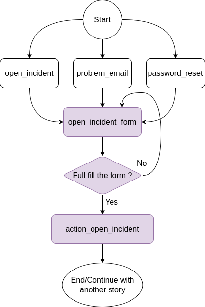

# Rasa Assistant Example

This is a Rasa chatbot example demonstrating how to build an AI assistant. Below is an example conversation, showing the bot helping a user open a support ticket and query its status.

<!-- START doctoc generated TOC please keep comment here to allow auto update -->
<!-- DON'T EDIT THIS SECTION, INSTEAD RE-RUN doctoc TO UPDATE -->
**Table of Contents**

- [Rasa Assistant Example](#rasa-assistant-example)
  - [Setup](#setup)
    - [Install the dependencies](#install-the-dependencies)
  - [Running the bot](#running-the-bot)
  - [Things you can ask the bot](#things-you-can-ask-the-bot)
  - [Testing the bot](#testing-the-bot)
  - [Rasa X Deployment](#rasa-x-deployment)
    - [Local Mode](#rasa-x-local-mode)
    - [Docker Compose Installation](#rasa-x-docker-image)
  - [Custom Action Server](#action-server)
    - [Action Server Image](#action-server-docker-image)

<!-- END doctoc generated TOC please keep comment here to allow auto update -->

## Setup

### Install the dependencies

In a Python3 virtual environment run:

```bash
pip install -r requirements.txt
```

## Configs

We recommend you run Rasa with a Docker Container, but if you want to test the bot locally, 
you maybe want to change below configs.

- endpoint.yml
  ```
  action_endpoint:
    url: "http://sdk-rasa:5055/webhook" -> "http://localhost:5055/webhook"
  tracker_store:
    type: sql
    dialect: "postgresql"
    url: ${DB_HOST} -> "localhost"
    port: ${DB_PORT} -> ""
    username: ${DB_USER} -> "user_name" (user_name for log in the database)
    password: ${DB_PASSWORD} -> (password for log in the database)
    db: ${DB_DATABASE} -> "" (You can find more information https://rasa.com/docs/rasa/tracker-stores/)
    login_db: ${DB_LOGIN_DB} -> "" (The parameter 'login_db' can only be used with a postgres database)
  ```
- config.yml
  ```
  language: en
  pipeline:
  - name: WhitespaceTokenizer
  - name: RegexFeaturizer
  - name: RegexEntityExtractor
  - name: LexicalSyntacticFeaturizer
  - name: CountVectorsFeaturizer
  - name: CountVectorsFeaturizer
    analyzer: "char_wb"
    min_ngram: 1
    max_ngram: 4
  - name: DIETClassifier
    epochs: 150
    random_seed: 1
  - name: FallbackClassifier
    threshold: 0.9
  - name: DucklingEntityExtractor
    url: http://duckling:8000 -> url: http://localhost:8000
    dimensions:
    - email
  - name: EntitySynonymMapper
  policies:
  - name: AugmentedMemoizationPolicy
    max_history: 4
  - name: TEDPolicy
    max_history: 4
    epochs: 100
  - name: RulePolicy
    core_fallback_threshold: 0.4
    core_fallback_action_name: "action_default_fallback"
    enable_fallback_prediction: True
  ```

## Running the bot

Use `rasa train` to train a model.

Then, to run, first set up your action server in one terminal window:

Note: You maybe need to install the dependency for the action server.
```bash
pip install -r sdk-requirements.txt
```

```bash
rasa run actions
```

In another window, run the duckling server (for entity extraction):

```bash
docker run -p 8000:8000 rasa/duckling
```

Then to talk to the bot, run:

```bash
rasa shell --debug
```

Note that `--debug` mode will produce a lot of output meant to help you understand how the bot is working
under the hood. You can also add this flag to the action server command. To simply talk to the bot, you can remove this flag.

## Things you can ask the bot

Take a look at `data/nlu.md` to see what the bot is currently trained to recognize.

It can also respond to requests for help (e.g. "help me").

An example story:



## Testing the bot

You can test the bot on the test conversations by running  `rasa test`.
This will run [end-to-end testing](https://rasa.com/docs/rasa/user-guide/testing-your-assistant/#end-to-end-testing) on the conversations in `tests/conversation_tests.md`.

## Rasa X Deployment

To [deploy helpdesk-assistant](https://rasa.com/docs/rasa/user-guide/how-to-deploy/), it is highly recommended to make use of the
[one line deploy script](https://rasa.com/docs/rasa-x/installation-and-setup/one-line-deploy-script/) for Rasa X. As part of the deployment, you'll need to set up [git integration](https://rasa.com/docs/rasa-x/installation-and-setup/integrated-version-control/#connect-your-rasa-x-server-to-a-git-repository) to pull in your data and
configurations, and build or pull an action server image.

### Rasa X Local mode

You can install Rasa X on your local machine with:
```bash
pip3 install rasa-x --extra-index-url https://pypi.rasa.com/simple
```

Note: Make sure that your Rasa, Rasa X is match with [**Compatibility Matrix**](https://legacy-docs-rasa-x.rasa.com/docs/rasa-x/0.42.x/changelog/compatibility-matrix)

### Rasa X Docker Image

Note: Rasa X is intended to be deployed on a server and not to a personal/local machine. Deploying on a server is recommended because Rasa X is designed to stay up continuously, and not to be frequently stopped or restarted.

You can follow with the official document of Rasa X [**here**](https://legacy-docs-rasa-x.rasa.com/docs/rasa-x/0.42.x/installation-and-setup/install/docker-compose)

Or use directly our docker-compose.yml
```bash
docker-compose up
```
The Rasa-X server will launch at [0.0.0.0:5009](http://0.0.0.0:5009)

## Action Server

Action Server is a server runs custom actions for a Rasa Open Source conversational assistant.


### Action Server Docker Image
See the Dockerfile for what is included in the action server image,

To build the image:

```bash
docker build . -t <name of your custom image>:<tag of your custom image>
```

To test the container locally, you can then run the action server container with:

```bash
docker run -p 5055:5055 <name of your custom image>:<tag of your custom image>
```

Once you have confirmed that the container works as it should, you can push the container image to a registry with `docker push`

It is recommended to use an [automated CI/CD process](https://rasa.com/docs/rasa/user-guide/setting-up-ci-cd) to keep your action server up to date in a production environment.
